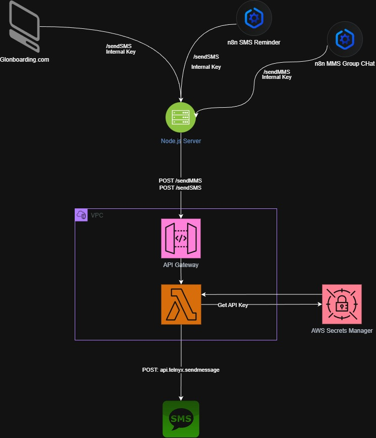

# Telnyx SMS/MMS Gateway

AWS SAM project that exposes API Gateway endpoints for sending SMS and MMS via [Telnyx](https://telnyx.com). Your Express (or other) server forwards requests to this gateway; the Lambda validates an internal token, fetches the Telnyx API key from AWS Secrets Manager, and sends the message.

## Architecture

Request flow: **Client → Express server → API Gateway → Lambda → Telnyx**. The Telnyx API key stays in AWS Secrets Manager and is only used by the Lambda, never exposed to the Express server or client.



```
Express/Vercel Server
        │
        │  POST /sendSMS, /sendMMS, or /sendBurstSMS
        │  Authorization: Bearer <INTERNAL_GATEWAY_TOKEN>
        ▼
   API Gateway (HTTP API)
        │
        ├──► Lambda (SendFunction)     → /sendSMS, /sendMMS
        │         auth.js, secrets.js, telnyx.js
        │
        └──► Lambda (BurstSendFunction) → /sendBurstSMS
                  burstHandler.js → Supabase + internal /sendSMS
```

## Prerequisites

- [Node.js 20+](https://nodejs.org/)
- [AWS CLI](https://aws.amazon.com/cli/) (configured with credentials)
- [AWS SAM CLI](https://docs.aws.amazon.com/serverless-application-model/latest/developerguide/install-sam-cli.html)

## Project Structure

```
.
├── template.yaml       # SAM template (API Gateway + Lambda + IAM)
├── package.json        # Dependencies (AWS SDK, axios, Supabase)
├── samconfig.toml      # SAM deploy config (gitignored; copy from samconfig.toml.example)
└── src/
    ├── handler.js      # Lambda entry: routes /sendSMS and /sendMMS
    ├── burstHandler.js # Lambda entry: /sendBurstSMS (Supabase → sendSMS)
    ├── auth.js         # Bearer token validation (blocks random callers)
    ├── secrets.js      # Fetches TELNYX_API_KEY from Secrets Manager (60s TTL cache)
    └── telnyx.js       # Sends messages via Telnyx API
```

## Setup

### 1. Install dependencies

```bash
npm install
```

### 2. Create the Telnyx secret in Secrets Manager

Store your Telnyx API key in AWS Secrets Manager before deploying:

```bash
aws secretsmanager create-secret \
  --name Telnyx-1 \
  --secret-string "YOUR_TELNYX_API_KEY"
```

Or as JSON:

```bash
aws secretsmanager create-secret \
  --name Telnyx-1 \
  --secret-string '{"TELNYX_API_KEY":"YOUR_TELNYX_API_KEY"}'
```

### 3. Configure deploy (optional)

Copy `samconfig.toml.example` to `samconfig.toml` and replace `REPLACE_WITH_YOUR_TOKEN` with your internal gateway token. (`samconfig.toml` is gitignored because it contains secrets.)

### 4. Build and deploy

```bash
sam build
sam deploy --guided
```

Or if you have `samconfig.toml` configured:

```bash
sam build
sam deploy
```

When prompted (or in `samconfig.toml`), set `InternalGatewayToken` to a shared secret your Express server will use in the `Authorization: Bearer` header. For `/sendBurstSMS`, also provide `SupabaseUrl` and `SupabaseServiceKey` (see [Burst handler](#burst-handler-sendburstsms) below).

## API Endpoints

| Method | Path           | Payload                                   | Description |
|--------|----------------|-------------------------------------------|-------------|
| POST   | /sendSMS       | `{ "to", "from", "text" }`                | Send SMS only. `mediaUrls` not allowed. |
| POST   | /sendMMS       | `{ "to", "from", "text", "mediaUrls": ["https://..."] }` | Send MMS. `mediaUrls[]` required. |
| POST   | /sendBurstSMS  | `{ "org_id" }`                            | Send all queued outbound SMS for an org from Supabase (see below). |

**Headers:** `Authorization: Bearer <INTERNAL_GATEWAY_TOKEN>`

**Example (SMS):**
```bash
curl -X POST https://<API_ID>.execute-api.us-east-1.amazonaws.com/sendSMS \
  -H "Authorization: Bearer your-internal-token" \
  -H "Content-Type: application/json" \
  -d '{"to":"+15551234567","from":"+15559876543","text":"Hello from Lambda"}'
```

**Example (MMS):**
```bash
curl -X POST https://<API_ID>.execute-api.us-east-1.amazonaws.com/sendMMS \
  -H "Authorization: Bearer your-internal-token" \
  -H "Content-Type: application/json" \
  -d '{"to":"+15551234567","from":"+15559876543","text":"Check this out","mediaUrls":["https://example.com/image.jpg"]}'
```

### Burst handler (/sendBurstSMS)

The burst handler reads queued outbound SMS from Supabase, sends each one via the gateway’s `/sendSMS` endpoint (with a short delay between calls), then updates both `lead_texts` and `leads` with the result.

**Flow:**

1. Request: `POST /sendBurstSMS` with body `{ "org_id": "<your-org-id>" }` and `Authorization: Bearer <INTERNAL_GATEWAY_TOKEN>`.
2. **Query Supabase** – Select from `public.lead_texts` where `org_id`, `direction = "outbound"`, and `status = "queued"`. Uses columns: `id`, `lead_id`, `number`, `from_number`, `message`.
3. **Send each row** – For each row, `POST` to the same API’s `/sendSMS` with `to` = `number`, `from` = `from_number`, `text` = `message`, with a 150 ms delay between requests.
4. **Update `lead_texts`** – Set `status` to `"sent"` or `"failed"`, set `telnyx_message_id` on success (or `null` on failure), and set `error` on failure (or `null` on success).
5. **Update `leads`** – When a message is sent successfully and `lead_id` is set, update `public.leads` so that the row with `id = lead_id` and `message_status = "queued"` has `message_status = "sent"`.
6. Response: `{ "ok": true, "data": { "processed", "sent", "failed" } }`.

**Supabase tables:**

- **`public.lead_texts`** – Must have at least: `id`, `lead_id` (FK to `leads.id`), `org_id`, `number`, `from_number`, `message`, `direction`, `status`, `telnyx_message_id`, `error`.
- **`public.leads`** – Must have at least: `id` (PK), `message_status`. `lead_texts.lead_id` references `leads.id`.

**Deploy parameters:** In addition to `InternalGatewayToken` and `TelnyxSecretId`, pass `SupabaseUrl` (e.g. `https://<project>.supabase.co`) and `SupabaseServiceKey` (Supabase **service role** key, not the anon key).

**Example:**
```bash
curl -X POST https://<API_ID>.execute-api.us-east-1.amazonaws.com/sendBurstSMS \
  -H "Authorization: Bearer your-internal-token" \
  -H "Content-Type: application/json" \
  -d '{"org_id":"your-org-id"}'
```

**Logging:** The burst Lambda logs to CloudWatch with the `[sendBurstSMS]` prefix (start, queued count, per-message sent/failed, completion summary, and errors).

## Security

- **Internal token:** Only requests with the correct `Authorization: Bearer` token are accepted.
- **Telnyx key:** Stored in Secrets Manager; never in your Express app or Vercel env.
- **Timing-safe comparison:** Token validation uses `crypto.timingSafeEqual` to avoid timing attacks.

## Outputs

After deploy, `ApiUrl` is printed. Use it as the base URL for `/sendSMS`, `/sendMMS`, and `/sendBurstSMS`.
